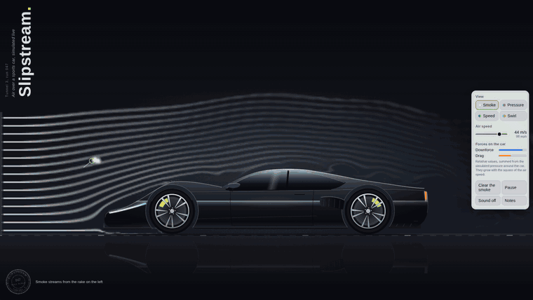

# Slipstream

**A live wind tunnel in your browser.** A real-time fluid simulation of air flowing over a hand-drawn sports car, in a single HTML file with no libraries and no build step.



**[▶ Try it live](https://rajheshh.github.io/slipstream/)**

---

## Features

- **Real fluid dynamics.** Velocity is solved every frame with Jos Stam's *stable fluids* method: semi-Lagrangian advection, vorticity confinement and a pressure projection, with the car as a solid obstacle.
- **Crisp smoke.** Smoke rides on a grid twice as fine as the airflow and is advected with MacCormack's method plus a limiter, so streaklines stay sharp instead of blurring into fog.
- **Six vehicles.** A sports car, a rally car, an aero car, an estate, a panel van and a streamlined record car, all hand-drawn. Compare how they part the air.
- **Aero car.** Built on the classic low-drag recipe: rounded nose, early roof peak, a tail tapering at under about 15° so the flow stays attached, a Kamm tail, covered rear wheels and a flat floor. It has the lowest drag in the tunnel, about a seventh of the van's.
- **Active rear spoiler.** On the sports car: down, up, or **auto**, which rises above 67 mph and tilts steeper as speed climbs. The obstacle updates as it moves, so you can watch it trade drag for less lift.
- **Ride height.** Standard, lowered or slammed: the body drops, the tyres tuck into the arches, and the gap under the car shrinks.
- **Louvred wings.** Optional vents on the sports car's front wings.
- **Smoke settings.** Density, number of streams, and five smoke colours.
- **Four views.** Smoke, pressure (suction versus stagnation), speed, and swirl (vorticity).
- **Smoke wand.** Press and drag anywhere in the air to paint smoke into the flow and stir it.
- **Rolling road.** The floor moves with the air, just as it does in real automotive wind tunnels.
- **Live forces.** Drag and downforce (or lift), summed from the surface pressure relative to the incoming air, on one scale so vehicles can be compared.
- **Hand-drawn vector vehicles.** Original designs, rasterised at your screen's exact resolution. Their outlines become the obstacle, and the wheels spin with the road.
- **Synthesised sound.** Wind noise made with the Web Audio API. It's off by default, with a visible toggle.
- **Adaptive quality.** Slower devices automatically step down the grid resolution to stay smooth.

## Controls

| Action | Mouse / touch | Keyboard (tunnel focused) |
|---|---|---|
| Smoke wand | Press and drag in the air | <kbd>Space</kbd> |
| Change view | View buttons | <kbd>1</kbd> – <kbd>4</kbd> |
| Air speed | Slider (20–50 m/s) | <kbd>↑</kbd> <kbd>↓</kbd> |
| Rear spoiler (sports car) | Down / Up / Auto | <kbd>S</kbd> cycles |
| Pause / play | Pause button | <kbd>P</kbd> |
| Speed meter | — | <kbd>F</kbd> |
| Clear smoke | Clear the smoke | <kbd>C</kbd> |
| Sound | Sound button | <kbd>M</kbd> |

## How it works

```
pointer / rake ──► smoke (fine grid) ◄── advected by ──┐
                                                       │
rolling road + car mask ──► velocity grid ──► advect ──► vorticity ──► pressure projection
                                                                         │
                                        relative downforce & drag ◄──────┘
```

1. **Air.** A coarse velocity grid (about 230 cells across on desktop) is advected, sharpened with vorticity confinement and made divergence-free by a Gauss–Seidel pressure solve.
2. **Obstacle.** The vehicle SVG is drawn into an off-screen canvas, and its alpha channel marks the solid cells. The road cells move at air speed. Wheels are lifted about two cells clear of the road in the mask, the 2D stand-in for air passing the tyres' sides, and any air pocket cut off from the inlet is filled in so its pressure can't drift.
3. **Smoke.** Dye is carried on a 2× finer grid using MacCormack advection with a min/max limiter, and is injected by the rake on the left and by the pointer.
4. **Rendering.** The dye or field is written to an `ImageData` buffer, then upscaled with smoothing. The car, wheels, reflection and rolling road are drawn on top at device pixel ratio.

The whole thing is one `index.html`: plain JavaScript, Canvas 2D, inline SVG and Web Audio.

## Run it locally

No install needed. Download `index.html` and open it in a browser, or serve the folder:

```bash
python3 -m http.server 8000
# then open http://localhost:8000
```

## Accessibility

- Every control is a real button with labels and pressed states.
- Keyboard shortcuts work only while the tunnel canvas has focus, so they never clash with screen readers.
- Respects `prefers-reduced-motion`: slower flow, and no idle animation.
- Pauses automatically when the tab is hidden.

## Notes

This is a two-dimensional sketch on a coarse grid, meant to show the character of the flow (attached flow over the roof, separation at the tail, low pressure under the floor). It is not an engineering CFD tool, and the force values are relative.

The vehicles are original designs drawn for this project. Louvres are cosmetic here: air escaping sideways through vents can't be shown in 2D. The tunnel is fictional.

## Credits

- Jos Stam, *Stable Fluids*, SIGGRAPH 1999.
- Selle et al., *An Unconditionally Stable MacCormack Method*, Journal of Scientific Computing, 2008.

## Licence

MIT. See [LICENSE](LICENSE).
